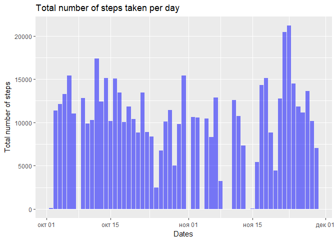
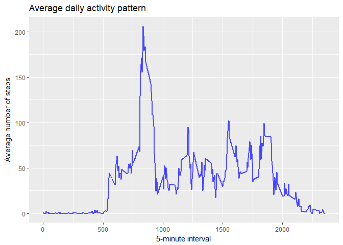
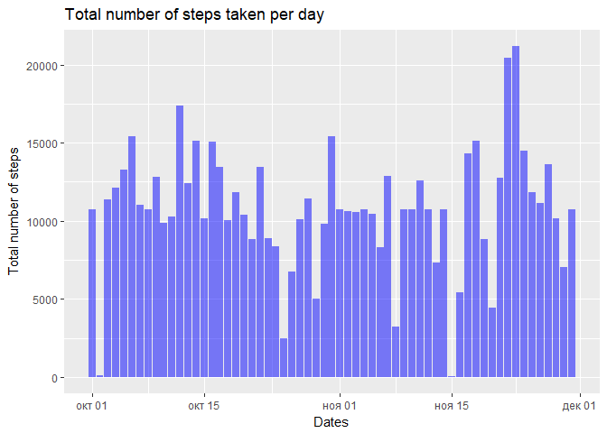
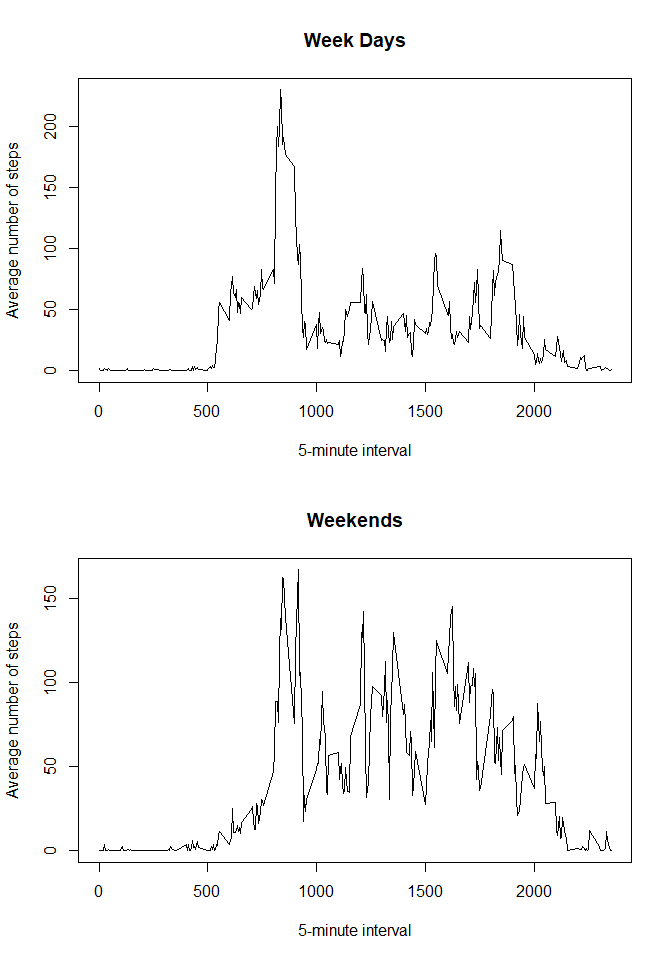

## Loading and preprocessing the data
We have data set in file with name **activity.csv**. We know that it's standard csv-file and know that missing values are coded as NA. Therefore we can use function **read.csv** for loading data.

```r
act_info <- read.csv('activity.csv', na.strings = 'NA')
str(act_info)
```

```
## 'data.frame':	17568 obs. of  3 variables:
##  $ steps   : int  NA NA NA NA NA NA NA NA NA NA ...
##  $ date    : Factor w/ 61 levels "2012-10-01","2012-10-02",..: 1 1 1 1 1 1 1 1 1 1 ...
##  $ interval: int  0 5 10 15 20 25 30 35 40 45 ...
```
We can see that column date has a class *factor* and we need to transform it into *date/time* format

```r
act_info$date <- as.Date(as.character(act_info$date),'%Y-%m-%d')
```

## What is mean total number of steps taken per day?
Now we should calculate the total number of steps taken per day. But as we know column **Steps** has NA-values and we need to delete it from our original data set for calculations.

```r
## Create a new data set without NA rows
act_fill <- act_info[!is.na(act_info$steps),]

## Calculate the total number of steps (sum of steps) taken per day
ttl_sum <- tapply(act_fill$steps,act_fill$date,sum)

## Transform result in data frame object
ttl_sum <- as.data.frame(ttl_sum)

## Create a histogram using ggplot2 package
library(ggplot2)
g <- ggplot(ttl_sum, aes(x=as.Date(row.names(ttl_sum),'%Y-%m-%d'), y=ttl_sum))
g+ geom_col(fill = 'blue', alpha = 1/2)+labs(x='Dates', y='Total number of steps', title='Total number of steps taken per day')
```

<!-- -->

And now calculating the mean and median of the total number of steps taken per day

```r
summary(ttl_sum)[3:4,]
```

```
##                                     
## "Median :10765  " "Mean   :10766  "
```

## What is the average daily activity pattern?
Create a time series plot of the 5-minute interval (x-axis) and the average number of steps taken, averaged across all days (y-axis)

```r
## Calculate the the average number of steps (mean of steps) taken per 5-minutes interval, averaged across all days
avr_int <- tapply(act_fill$steps,act_fill$interval,mean)

## Transform result in data frame object
avr_int <- as.data.frame(avr_int)

## Create graphic
gg <- ggplot(avr_int, aes(x=as.numeric(row.names(avr_int)), y=avr_int))
gg+geom_line(alpha=.7, size=1, color='blue')+labs(x='5-minute interval', y='Average number of steps', title='Average daily activity pattern')
```

<!-- -->

And here we calculate values of 5-minute interval, on average across all the days in the dataset, contains the maximum number of steps

```r
names(avr_int[which(avr_int == max(avr_int)),])
```

```
## [1] "835"
```

## Imputing missing values

Calculating and reporting the total number of missing values in the dataset. We checked that NA values there are only on Steps column

```r
sum(is.na(act_info))
```

```
## [1] 2304
```

Now try to fill missing values using strategy of the mean for similar 5-minute interval

```r
## Calculate number of rows which contains NA
num_r <- which(is.na(act_info) == TRUE)

## Create new data set for filling missing values
act_full <- act_info

## Create loop for filling missing values
for(i in 1:length(num_r)) {
               act_full[num_r[i],1] <- avr_int[which(row.names(avr_int) == act_info[num_r[i],3]),]
}
```

Doing histogram for data set with filled missing values

```r
## Calculate the total number of steps (sum of steps) taken per day
ttl_sum <- tapply(act_full$steps,act_full$date,sum)

## Transform result in data frame object
ttl_sum <- as.data.frame(ttl_sum)

## Create a histogram using ggplot2 package
library(ggplot2)
g <- ggplot(ttl_sum, aes(x=as.Date(row.names(ttl_sum),'%Y-%m-%d'), y=ttl_sum))
g+ geom_col(fill = 'blue', alpha = 1/2)+labs(x='Dates', y='Total number of steps', title='Total number of steps taken per day')
```

<!-- -->

```r
summary(ttl_sum)[3:4,]
```

```
##                                     
## "Median :10766  " "Mean   :10766  "
```

As we can see, these values not very differ from the estimates from the first part of the assignment and impact of imputing missing data on the estimates of the total daily number of steps not significant.

## Are there differences in activity patterns between weekdays and weekends?
Now we'r creating a new factor variable in the dataset with two levels Ц УweekdayФ and УweekendФ indicating whether a given date is a weekday or weekend day

```r
## SORRY but I have Russian system language therefore I need use Russian names for days of week
## Create vectors with names of weekdays
weekday <- c('понедельник','вторник','среда','четверг','п€тница')

## Create new column in our data set
act_full$wday <- factor((weekdays(act_full[,2]) %in% weekday), levels=c(FALSE, TRUE), labels=c('weekend', 'weekday'))

## Now create graphic
avr_wd <- tapply(act_full$steps,list(act_full$interval, act_full$wday),mean)
avr_wd <- as.data.frame(avr_wd)
```

We calculated 

```r
par(mfrow=c(2,1))
plot(x=as.numeric(row.names(avr_wd)), y=avr_wd$weekday, xlab = '5-minute interval', ylab = 'Average number of steps', main = 'Week Days', type='l')
plot(x=as.numeric(row.names(avr_wd)), y=avr_wd$weekend, xlab = '5-minute interval', ylab = 'Average number of steps', main = 'Weekends', type='l')
```

<!-- -->

